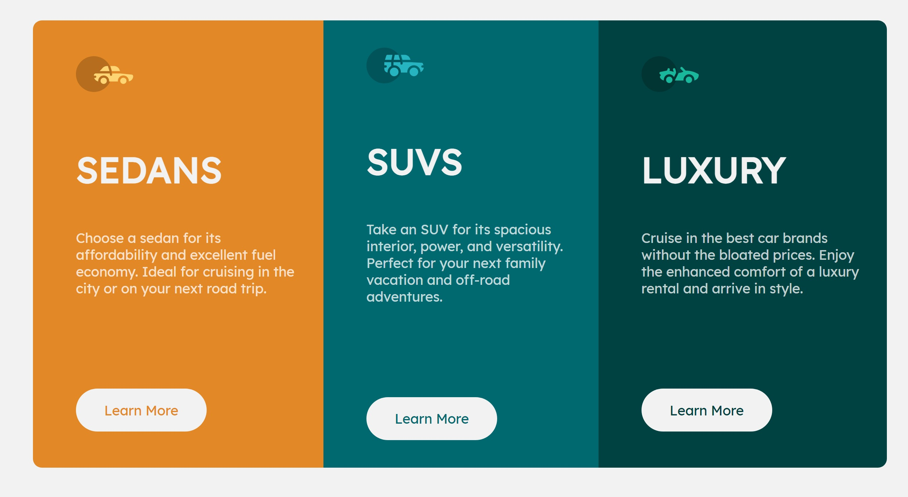

# 3-column Preview Card Component

## Table of contents

- [Overview](#overview)
  - [The challenge](#the-challenge)
  - [Screenshot](#screenshot)
  - [Links](#links)
- [My process](#my-process)
  - [Built with](#built-with)
  - [What I learned](#what-i-learned)
- [Author](#author)

## Overview

### The challenge

Users should be able to:

- View the optimal layout depending on their device's screen size
- See hover states for interactive elements

### Screenshot

### Links

- Live Site URL: [threecols-jason](https://threecols-jason.netlify.app)

## My process

### Built with

- Semantic HTML5 markup
- CSS custom properties
- Flexbox
- Adobe XD (Framing)

### What I learned

I was able to vastly speed up my creation process by using framing tools to map out the design before build. I usuallt have been focusing on improving my web design ski directly, but it is important to plan the process out before hand. This allows me to see everything before a design to see if I a have a good plan to execute.

I also found it is better to design for the smallest width of mobile first and then increase the size gradually instead of starting at 768px. This means starting with around a max-width of 375px and then increasing the width. This ensures that the layout will look good on all screen sizes.

## Author

- Website - [Jason Nembhard](https://www.jasonnembhard.com)
- Frontend Mentor - [@jNembhard](https://www.frontendmentor.io/profile/jNembhard)
